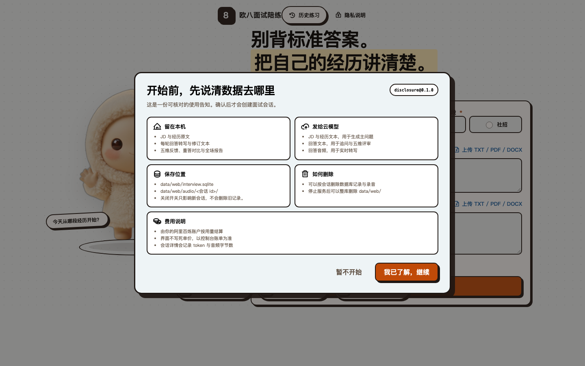
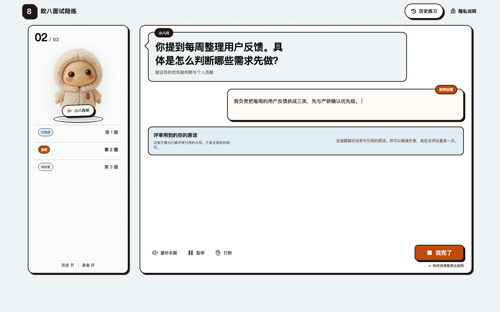
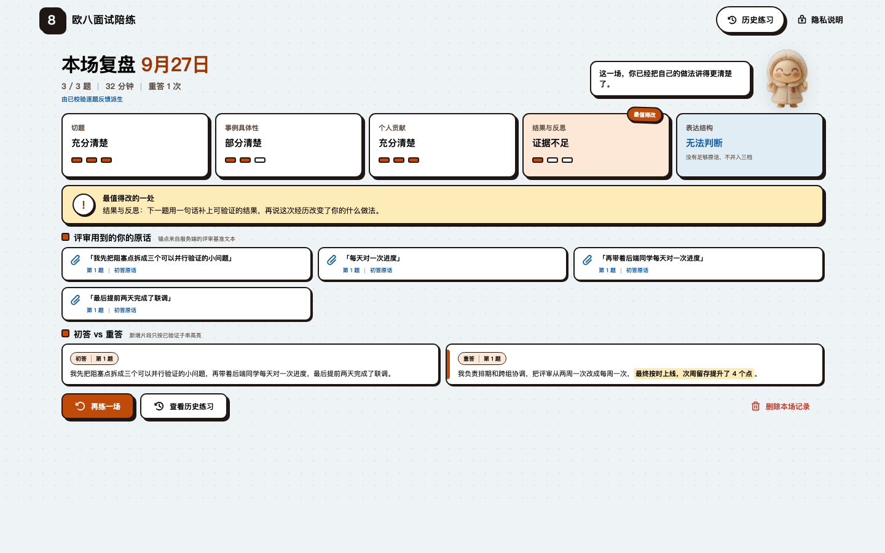

# 欧八面试陪练（AI 面试官）

把目标岗位 JD 和你的经历喂给它，在网页里和 AI 面试官「小八」语音过招：它按你的经历出题、逐题追问，你答完每一题都拿到五维点评——每条评语都引用你实际说过的原话，同一题还能重答对比。

它只训练「经历面试」这一件事：把问题答准、把个人贡献讲清楚、看清自己的证据缺口，并通过重答改进。它不预测录用结果，也不复刻招聘方的评分体系。

**在线版已上线：** <https://interview.redboook.cn/> —— 免安装，打开网页、填入你自己的阿里百炼 API Key 就能开练。更在意数据完全不出本机的话，往下看本地运行。

**44 秒宣传片：**

https://github.com/user-attachments/assets/485891d3-e4d4-436b-b4db-4e98593061ba

<p align="center"><sub>宣传视频画面为方案 C 实现评审素材，内容全是虚构演示数据。</sub></p>

<p align="center">
  
  
  
</p>

<p align="center"><sub>左：开练前先讲清数据去哪；中：语音作答，下方虚线卡片是评审引用的你的原话；右：五维评分与重点改进建议。截图为方案 C 实现评审素材，内容全是虚构演示数据。</sub></p>

## 它怎么工作

1. **给材料**：粘贴 JD 与经历，或上传 `.pdf`／`.docx`／`.txt`／`.md` 附件（本地解析，不出本机；扫描件 PDF 会明确报错，不会拿乱码冒充成功）。
2. **开练**：小八按你的经历出题、逐题语音提问（阿里百炼 Qwen-Omni-Realtime 实时语音模型）；你语音作答，可打断、可重听。
3. **逐题点评**：每题收到五个维度的点评——切题、事例具体性、结构、个人贡献、表达——每条评语都附「你当时是这么说的」的逐字引用，评不到你没说过的话。
4. **重答**：同一题可以再答一次，复盘报告里初答／重答并排对比。
5. **复盘**：一场结束生成复盘报告（五维评分、原话引用、重点改进建议）；历史与录音存在本机 SQLite，随时可删，删除有回执。

## 快速开始

### 方式一：在线版（免安装）

打开 <https://interview.redboook.cn/>，在「模型配置」页填入你自己的阿里百炼 API Key（北京地域），然后开始第一场。语音实时模型按 token 计费，费用由你自己的账号承担——服务器不内置任何部署者的 Key。

数据按访客隔离保存在服务器（含加密后的 Key）；访客身份就是浏览器 Cookie，没有账号体系，清掉 Cookie 就找不回数据（服务器上的记录也不会因此删除）。小规模试用配置，容量边界见 [docs/deploy-baota.md](docs/deploy-baota.md)。

### 方式二：本地运行（数据不出本机）

需要 Node ≥ 20、一枚阿里百炼（DashScope）API Key。语音实时模型按 token 计费，费用由你自己的账号承担；服务只绑 `127.0.0.1`。

```bash
git clone https://github.com/ouxxyy/ai-interviewer.git
cd ai-interviewer
npm install
npm run web:serve        # 构建并启动本地服务
```

浏览器打开 <http://127.0.0.1:8918>，在「模型配置」页填入 `DASHSCOPE_API_KEY`（只经本机回环请求写进项目根 `.env`，浏览器不保存、不回显），然后开始第一场。

也可以提前配好：`cp .env.example .env`，填入 `DASHSCOPE_API_KEY=`。

## 另外两个入口（纯文字，不带语音）

- **Claude Skill**：[`skills/ai-interviewer/`](skills/ai-interviewer/INSTALL.md)——装进支持 Skill 的宿主按流程完整跑一场（Codex 宿主实测通过；Claude Code 撞配额未验证）。
- **简版 Prompt**：[`prompt/ai-interviewer-prompt.md`](prompt/ai-interviewer-prompt.md)——单文件自包含，粘进任何聊天窗口即可开始；但没有引用校验回环，第三方聊天 UI 未实测。

三个入口共用同一份训练规则（`rules@0.2.0`，由 `src/rules/rules.ts` 单源生成），评分口径一致。

## 隐私设计

**本地运行：**

- 服务只绑 `127.0.0.1`；材料解析、历史、录音全部落在本地 SQLite／文件，没有服务器可上传。
- API Key 只存本机 `.env`，不进浏览器存储、日志与报告。
- `npm run web:info` 可以查到数据目录到底在哪。

**在线版（同一套代码的公网部署）：**

- 访客之间数据互相隔离（公网冒烟验证过：跨访客读取／删除一律 404），但你的历史、录音与加密后的 Key 确实存在服务器上；服务器不内置部署者的 Key。
- 访客身份只是浏览器 Cookie：没有登录、跨设备同步或身份找回，清 Cookie 即失联，且不会删除服务器上的记录。
- 部署与访客隔离的公网验收记录见 [docs/public-deployment-acceptance.md](docs/public-deployment-acceptance.md)。

**两种方式共同：**

- 两个开关按场生效：「历史」关＝这场不落库不落录音；「录音」关＝落库不落 WAV。关开关不会删旧记录。
- 删除带回执。
- 数据告知不是注册协议里的小字：开练前会先弹「数据使用告知」，逐条讲清哪些留在本机、哪些会发给云模型。

## 已验证与未验证（如实标注）

以下链路真跑通过（真实 Chrome ＋ 真实百炼调用，证据在 `docs/` 与 `evidence/`）：材料解析 → 出题 → 语音问答 → 转写 → 逐题反馈 → 报告落库；评审引用 23/23 逐字可定位；浏览器 ↔ 服务端音频链路有实测分片与字节记录。

在线版（interview.redboook.cn）是同一套代码的公网部署：HTTPS/WSS 传输与访客数据隔离已通过公网冒烟（28 项断言，`evidence/public/https-wss-smoke.json`）；为控制费用，公网验收用的是无效合成 Key（`paidCalls: 0`），整场真实模型调用与真人麦克风未在公网复验——在线版的模型链路以上述本地同代码记录为准，公网验收细节见 [docs/public-deployment-acceptance.md](docs/public-deployment-acceptance.md)。

还没验证或已知的问题，挑要紧的说：

- **真人麦克风未验证**：验收里「用户回答」是合成语音推流——链路是真的，声音不是真人；环境噪声与真实语速未测。
- **评审延迟未达标**：「提交评审 → 完整点评」P95 约 30 秒（目标 15 秒），根因与改进建议见 `docs/t2-acceptance.md`。
- **评分质量未定标**：提示词只做了结构与契约对齐；代表案例复测结果为「档位不跨两档 4/4、与人工预期一致 3/4」。
- 仅在 macOS（Apple Silicon）实测；Windows／Linux 未验证。

完整的阶段验收状态、命令清单与已知限制见 [docs/project-status.md](docs/project-status.md)。

## 开发与维护

```bash
npm test                                              # 构建并跑全部单测（node --test，196 项）
npm run build                                         # 编译 Node 端并构建 React 前端到 dist/web-client/
npm run web:dev                                       # 启动 Vite 开发服务，代理 API 与 WS 到 8918
npm run web:info                                      # 查看数据目录、迁移版本、凭证存在性与设置
npm run web:evidence                                  # 真实 Chrome + 百炼全链路验收（会产生 API 费用）
npm run validate -- <file.json> <contract-name>       # 独立契约校验 CLI
```

涉及真实模型调用的验收命令（会产生 API 费用）与维护纪律见 [AGENTS.md](AGENTS.md) 和 `docs/` 下各验收记录。

## 作者

作者全平台同名：**欧八同学**。

- 个人主页 / 联系我：[albertou.redboook.cn](https://albertou.redboook.cn/)
- 微信公众号：扫码关注
- 抖音：[搜索“欧八同学”](https://www.douyin.com/search/%E6%AC%A7%E5%85%AB%E5%90%8C%E5%AD%A6)
- 小红书：[搜索“欧八同学”](https://www.xiaohongshu.com/search_result?keyword=%E6%AC%A7%E5%85%AB%E5%90%8C%E5%AD%A6)
- X：[搜索“欧八同学”](https://x.com/search?q=%E6%AC%A7%E5%85%AB%E5%90%8C%E5%AD%A6&src=typed_query)

<p align="center">
  
</p>

如果这个项目对你有用，欢迎点个 Star。遇到问题时，提交命令、报错和最小复现步骤就够了；请不要上传真实私人照片。

## 许可证

[MIT](LICENSE)。本项目未复制第三方仓库代码；开发期参考过的开源仓库与采用边界记录在 `docs/reference-audit.md`。
